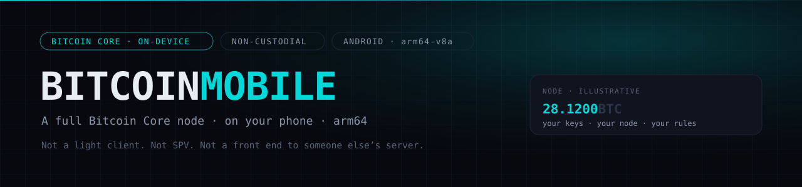

<p>


<a href="https://github.com/Solitechworld/BitcoinCoreNodePro/actions/workflows/build.yml"></a>
</p>

[cnsunzone.com](https://cnsunzone.com) · [Architecture](docs/01-ARCHITECTURE.md) · [Build on Linux](docs/08-BUILD-LINUX.md) · [Build on Windows](docs/09-BUILD-WINDOWS.md) · [Security](docs/04-SECURITY.md)

A full **Bitcoin Core 30.3** node and descriptor wallet for Android, with a
cyberpunk HUD interface.

Not a light client. Not an SPV wallet. Not a front end to somebody else's
server. The actual `bitcoind` binary, cross-compiled for arm64, running as a
child process on the phone — with the option to drive a node you run elsewhere
instead, over Tor.

```
┌───────────────┐   JSON-RPC    ┌──────────────────────────┐
│  Compose UI   │◄─────────────►│ libbitcoind.so (arm64)   │
│  Kotlin       │  127.0.0.1    │ Bitcoin Core 30.3        │
└───────────────┘               └──────────────────────────┘
        │           JSON-RPC over Tor
        └──────────────────────────────► your own node, anywhere
```

One `RpcClient` interface, two transports. Every screen works identically
against either.

---

## The constraints that shaped this

The interesting problems were not in the UI.

**Android does not let you `exec()` from just anywhere.** The only directory
permitted is `nativeLibraryDir`, and the installer only writes a real file there
when the APK uses legacy (compressed) JNI packaging. So the Core binary ships as
a position-independent executable named `libbitcoind.so`, with
`extractNativeLibs=true` deliberately held on — the setting a well-meaning
"optimisation" removes, after which the node silently cannot start.

**16 KB memory pages.** Play requires 64-bit native code to support them, and a
misaligned binary does not fail gracefully — it does not load at all. Every
`PT_LOAD` segment is checked for `p_align = 0x4000` at packaging time, and
`native/scripts/30-package-jnilibs.sh` refuses to produce a build that fails.

**API 28 is a floor set by the node, not the UI.** Core's `random.cpp` wants
`getrandom()`/`getentropy()`, which bionic only exposes from Android 9.

**`arm64-v8a` only.** A 32-bit address space is a poor fit for a UTXO cache, and
Play has required 64-bit since 2019.

Non-custodial throughout: keys never leave the device, there is no service, no
counterparty and no order book. PSBT, RBF, coin control, and a biometric gate
before signing. File access goes through the Storage Access Framework rather
than asking for `MANAGE_EXTERNAL_STORAGE`.

---

## Status

| Area | State |
|---|---|
| Native build chain (Core → Android) | Written, not yet run end-to-end |
| RPC layer, models, error taxonomy | Complete; models verified against Core source |
| Node supervisor, lifecycle, log tailing | Complete |
| Design system | Complete |
| Screens | Dashboard, Node, Peers, Mempool, Console, Wallets, Wallet, Send, Receive, Settings |
| Wallet: send / coin control / RBF / PSBT | Complete via Core RPC |
| Block-explorer fallback (Blockbook) | Client, models and settings complete; **schema not yet verified against a live server** |
| Donation footer / panel | On every screen, plus the send screen; address checksum-tested in CI |
| Tor | Transport implemented; requires Orbot. Bundled Tor is a follow-up |
| Play release pipeline | Scaffolded — see `docs/06-PLAY-RELEASE.md` |
| iOS | Planned — see `docs/07-IOS-PORT.md` |

It builds. CI runs lint, the unit tests and a full `assembleDebug` on every push
to `main`. A signed release bundle has been produced and verified: signature,
16 KB alignment on every native segment, and `extractNativeLibs=true` intact in
the merged manifest.

---

## Build

Two steps, in order.

### 1. The native payload (once, ~30–60 min)

```bash
cd native/scripts
export BCN_BUILD_DIR="$HOME/bcn-build"
export BITCOIN_SRC="$HOME/bitcoin-30.3"          # extracted bitcoin-30.3.zip
export ANDROID_NDK_HOME="$HOME/Library/Android/sdk/ndk/27.2.12479018"
./build-all.sh
```

Produces `app/src/main/jniLibs/{arm64-v8a,x86_64}/libbitcoind.so`.
Full detail, including why the build paths must be space-free: **`docs/02-BUILD-NATIVE.md`**.

### 2. The app

```bash
./gradlew assembleDebug
```

Per-host setup: **`docs/08-BUILD-LINUX.md`**, **`docs/09-BUILD-WINDOWS.md`**,
and `BUILD-ON-YOUR-MAC.md` for macOS. On Windows the app builds natively with
`gradlew.bat`; only the Core cross-compile needs WSL2, and the Windows guide
explains why.

A release build refuses to start if the native payload is missing, rather than
producing an APK with no node in it.

---

## Documentation

| | |
|---|---|
| `docs/01-ARCHITECTURE.md` | Why it is built this way, and what was rejected |
| `docs/02-BUILD-NATIVE.md` | Cross-compiling Bitcoin Core for Android |
| `docs/03-BUILD-APP.md` | Gradle, modules, running it |
| `docs/04-SECURITY.md` | Threat model, key handling, what this app does not protect against |
| `docs/05-USER-MANUAL.md` | For the person holding the phone |
| `docs/06-PLAY-RELEASE.md` | Signing, Data Safety, store listing, the release runbook |
| `docs/07-IOS-PORT.md` | What ports cleanly, and the one thing that does not |
| `docs/08-BUILD-LINUX.md` | Building on Linux — packages, SDK/NDK, devices over udev |
| `docs/09-BUILD-WINDOWS.md` | Building on Windows — the app natively, the node in WSL2 |

---

## Funding


[](https://mempool.space/address/1Be6LLAEndprdWKiH6YM62setFQRXJzfha)

This is built without institutional backing, and it needs serious funding to
reach where it should go: an audited release, a bundled Tor transport rather
than a dependency on Orbot, an iOS port, and the sustained maintenance that
follows every Bitcoin Core upgrade.

Running a real node should not require a desktop, a static IP or a spare
machine. Putting one in everyone's pocket changes who gets to verify the chain
for themselves rather than trusting someone who has. That is the bet — an
ambition being worked toward, not a promise. Nothing here is an investment offer
and no return of any kind is implied.

To support the work directly:

```
bitcoin:1Be6LLAEndprdWKiH6YM62setFQRXJzfha
```

`1Be6LLAEndprdWKiH6YM62setFQRXJzfha` — mainnet P2PKH. The same address is
compiled into the app as `Donation.ADDRESS` and covered by a checksum test in
CI. Verify the first and last four characters before sending anything.

For sponsorship, contract work, or a serious conversation about backing the
project, open an issue.

---

## Licence

Bitcoin Core is MIT. This app is MIT. The Core source is used unmodified —
there are no patches to consensus, wallet, or validation code, and there never
should be.
